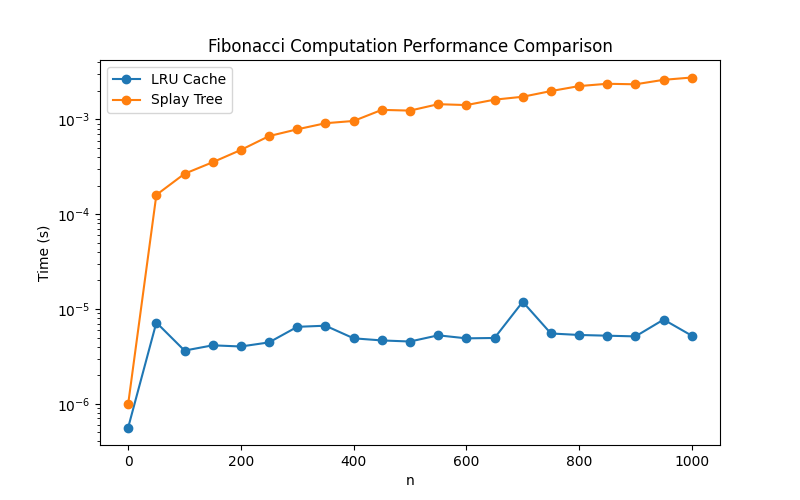

# goit-algo2-hw-07

## GOIT Design and Analysis of Algorithms Homework 7

### Requirements

- Python 3.10+
- Git

### Usage

Clone this repository:
```shell
git clone https://github.com/AntonChubarov/goit-algo2-hw-07.git
```

Navigate to project directory:
```shell
cd goit-algo2-hw-07
```

Install dependencies:
```shell
pip install -r requirements.txt
```

For Task 1 run the tests:
```shell
python3 -m unittest
```

For Task 2 run the script:
```shell
python3 fibonacci.py
```

Review fib_comparison.png file.
Example:

